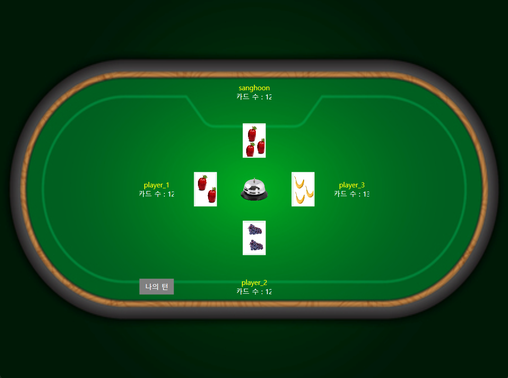

# 🃏 Halli Galli Multiplayer (Server + Client)

## 📌 프로젝트 개요

- 카드 게임 **Halli Galli**를 네트워크 기반으로 구현한 프로젝트입니다.  
- **서버**와 **클라이언트** 코드가 모두 포함되어 있으며, TCP 소켓 통신을 통해 멀티플레이를 지원합니다.  

---

## 📂 디렉토리 구조

├── server/      # 게임 서버 코드
├── client/      # 게임 클라이언트 코드
├── docs/        # 규칙, 시퀀스 다이어그램, 실행 예시
└── readme.md    # 본 파일

---

## 🚀 주요 특징
멀티플레이 지원 (최대 4인)

- JSON 기반 통신 프로토콜
- 카드 배분, 턴 관리, 종(Bell) 입력 로직 구현
- WPF 기반 클라이언트 UI

---

## 🔧 실행 방법
- 같은 네트워크에 연결된 공간에서 서버 작동
- 이후 최대 4명의 Client 코드 작동
- 게임 시작 버튼을 누를 시 게임이 진행
